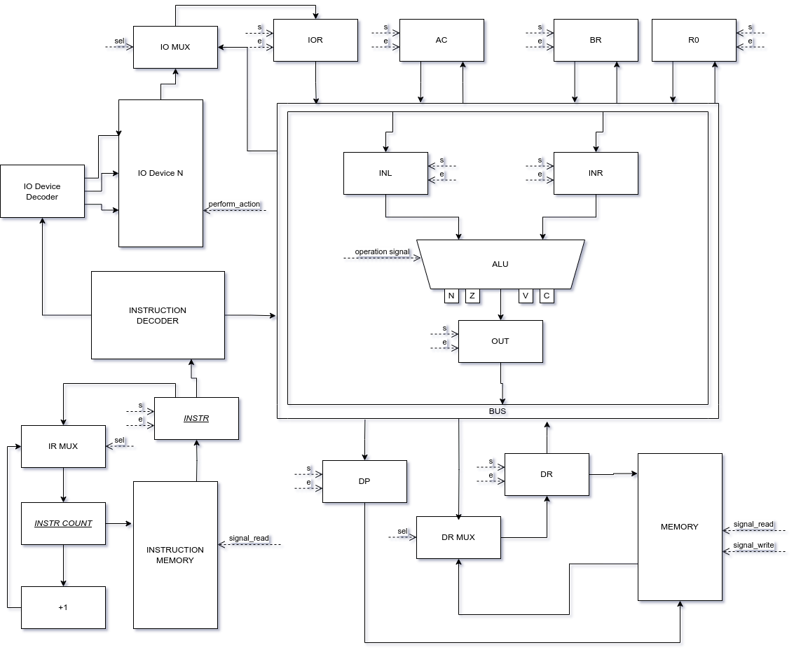

# Лабораторная работа №3. Отчёт

Кизилов Степан Александрович, P33312

`alg | cisc | harv | hw | instr | binary | stream | port | cstr | prob2 | 8bit`

С усложнением

## Язык программирования

### Синтаксис:

```
<program> ::= <statement>
<statement> ::= "if" <paren_expression> <statement> |
                "while" <paren_expression> <statement> |
                "{" { <statement> } "}" |
                <expression> ";" |
                ";"

<paren_expression> ::= "(" <cmp> ")"
<cmp> ::= <math>, { ( "<" | ">" | "==" | "<=" | ">=" ) <math> }

<expression> ::= <set_expression> | <io_expression>
<set_expression> ::= <variable_name> "=" <math>
<io_expression> ::= <read_expression> | <print_expression>
<read_expression> ::= "read" <variable_name>
<print_expression> ::= "print" ( <variable_name> | <string> )
<math> ::= <term> | <term> ( "+" | "-" | "*" | "/" | "%" ) <term>
<term> ::= <variable_name> | <int> | <char> | <string>

<string> ::= '"' <character>, { <character> | <underscore> | " " } '"'
<char> ::= "'" ( <character> | "\0" | "\n" ) "'"
<variable_name> ::= <character>, { <character> | <underscore> }
<character> ::= "a" | "b" | ... | "z" | "A" | ... "Z"
<underscore> ::= "_"

<int> ::= <digit>, { <digit> }
<digit> ::= "0" | "1" | "2" | "3" | "4" | "5" | "6" | "7" | "8" | "9"
```

### Особенности:

- У переменных глобальная область видимости
- Типизация динамическая 
- Типы переменных
  - `int32`
  - `char`
  - `string`
- Поддерживается математика
- Поддерживаются конструкции `if` и `while`
- Поддерживаются операторы
  - `print <variable>`
  - `print <string>`
  - `read <variable>`

## Организация памяти:

### Память инструкций

Память для хранения инструкций для выполнения программы. 
Машинное слово - 8 бит, реализуется списком объектов класса Command.

### Память данных

Размер слова 8 бит. Реализуется словарём `dict[int, MemoryWord]`
В памяти лежат данные `<int>`, `<char>` и переменные.
Встреченные строки добавляются в конец памяти. Конец строки - `'\0'`.

### Регистры

#### Основные:

- _AC_
- _BR_
- _R0_
- _IOR_

#### Как часть ALU

- _INL_
- _INR_
- _OUT_

#### Как часть памяти

- _DR_
- _DP_

### Особенности

Основной литерал для работы - `int32`. Он занимает 4 ячейки памяти. Хранится в формате `little-endian`.
Если числовая константа при присвоении занимает меньше 1 ячейки, 
то будет выполнения её прямая загрузка (как часть команды) 

`char` занимает также 4 ячейки памяти, но основной рабочей единицей является только первая ячейка.

`string` - в каждой ячейке хранится по одному символу. Конец - ячейка с `0x0`

## Система команд

### Особенности процессора:

- Машинное слово - 8 бит
- Доступ к памяти данных осуществляется по адресу, который указан в инструкции
- Ввод/вывод осуществляется с помощью портов
- Поток управления: CMP - позволяет установить флаги, после чего можно произвести JMP (+ варианты по флагам)

### Пример команд

```
26 | 0010011000010000010100000000110000001000         | CMP $0c, $08
...
2d | 00101101000100011000000000110101                 | JMP .35
30 | 001100000000101001010100000111000001110000000100 | ADD $1c <- $1c, $04
...
99 | 1001100100000001                                 | HLT
```

- В скомпилированном файле первые 8 бит хранят адрес команды
- Последующие 8 бит хранят `CommandName`
- Затем идут 8 бит, разделённые на группы по 2 (исключение - `HLT` и `NOP`).
Каждая из групп показывает адресацию операнда, либо его отсутствие в случае `0x0`:

  - `NO_ADDRESS = 0x0`
  - `MEMORY_DIRECT = 0x1`
  - `DIRECT_LOAD = 0x2`
  - `REGISTER = 0x3`
- После этого идут `n` операндов по 8 бит, где `n` - количество ненулевых адресаций

### Набор инструкций

- Служебные:
  * NOP = 0x0
  * HLT = 0x1

- Простые операции
  * INC = 0x2
  * DEC = 0x3
  * OR = 0x6
  * AND = 0x7
  * SHL = 0x8
  * SHR = 0x9

- Операции сложнее
  * ADD = 0xA
  * SUB = 0xB
  * MUL = 0xC
  * DIV = 0xD

- Операции для 1 ячейки
  * ADD1 = 0xE
  * SUB1 = 0xF

- Особая загрузка в память / из памяти
  * LD = 0x4
  * ST = 0x5

- Branch
  * CMP = 0x10
  * JMP = 0x11
  * JE = 0x12
  * JNE = 0x13
  * JA = 0x14
  * JAE = 0x15
  * JB = 0x16
  * JBE = 0x17

- Перемещение данных
  * MOV = 0x20
  * MOV4 = 0x21

- Ввод-вывод
  * IN = 0x22
  * OUT = 0x23

## Транслятор

Интерфейс командной строки: `pipenv run python -m csa_lab3.translator <input_file> <target_file>`

Реализовано в модуле [translator](./csa_lab3/translator.py)

Этапы трансляции (функция `compile_code`):

- `Lexer` преобразовывает текст в последовательность термов
- `Parser` строит AST-дерево
- `Compiler` генерирует машинный код на основе AST-дерева

В результате формируется 3 файла:

- `<target_file>` - исполняемый файл
- `<target_file>.mem` - файл с памятью данных
- `<target_file>.txt` - файл с расшифровкой бинарных инструкций

## Модель процессора

Интерфейс командной строки: `pipenv run python -m csa_lab3.machine <code_file> <buffer_text>`

Так же для запуска симуляции можно использовать функцию `simulation`

### Схема



### Описание

- `s` - открыть регистр для записи
- `e` - открыть регистр для чтения
- `sel` - произвести выбор в мультиплексоре
- `operation signal` - выбор операции АЛУ
- `signal_read` - произвести чтение из памяти
- `signal_write` - произвести запись в память
- `perform_action` - дёрнуть IO устройство

## Тестирование

### Алгоритмы

В качестве тестовых алгоритмов реализовано [5 программ](./programs):

- cat
- hello
- hello_user_name
- prob2
- types

### Тесты

Были разработаны [unit-тесты](./tests/test_data_path.py), а так же [golden-тесты](./tests/golden)

Для запуска можно использовать `pipenv run pytest`

### Пример программы

```aul
{
    print "Hello world!";
}
```

После компиляции получаем файл с командами:

```
00 | 0000000000100000111000000000001000000000         | MOV R02, .00
04 | 0000010000000100111100000000001100000010         | LD R03, R02
08 | 0000100000010000111000000000001100000000         | CMP R03, .00
0c | 00001100000100101000000000011000                 | JE .18
0f | 00001111001000111000000000000001                 | OUT .01
12 | 00010010000000101100000000000010                 | INC R02
15 | 00010101000100011000000000000100                 | JMP .04
18 | 0001100000000001                                 | HLT
```

Журнал работы (находится в `stdout`)

```
DEBUG:1) LD R03, R02 - AC: 00 | BR: 00 | DP: 00 | DR: 00 | INL: 00 | INR: 00 | IOR: 00 | OUT: 00 | R0: 00 | N: 0, Z: 0, V: 0, C: 0
DEBUG:2) CMP R03, .00 - AC: 00 | BR: 00 | DP: 00 | DR: 48 | INL: 00 | INR: 00 | IOR: 48 | OUT: 00 | R0: 00 | N: 0, Z: 0, V: 0, C: 0
DEBUG:3) JE .18 - AC: 00 | BR: 00 | DP: 00 | DR: 48 | INL: 48 | INR: 00 | IOR: 48 | OUT: 48 | R0: 00 | N: 0, Z: 0, V: 0, C: 0
DEBUG:4) OUT .01 - AC: 00 | BR: 00 | DP: 00 | DR: 48 | INL: 48 | INR: 00 | IOR: 48 | OUT: 48 | R0: 00 | N: 0, Z: 0, V: 0, C: 0
DEBUG:5) INC R02 - AC: 00 | BR: 00 | DP: 00 | DR: 48 | INL: 48 | INR: 00 | IOR: 48 | OUT: 48 | R0: 00 | N: 0, Z: 0, V: 0, C: 0
DEBUG:6) JMP .04 - AC: 00 | BR: 00 | DP: 00 | DR: 48 | INL: 00 | INR: 00 | IOR: 48 | OUT: 01 | R0: 01 | N: 0, Z: 0, V: 0, C: 0
DEBUG:7) LD R03, R02 - AC: 00 | BR: 00 | DP: 00 | DR: 48 | INL: 00 | INR: 00 | IOR: 48 | OUT: 01 | R0: 01 | N: 0, Z: 0, V: 0, C: 0
DEBUG:8) CMP R03, .00 - AC: 00 | BR: 00 | DP: 01 | DR: 65 | INL: 00 | INR: 00 | IOR: 65 | OUT: 01 | R0: 01 | N: 0, Z: 0, V: 0, C: 0
DEBUG:9) JE .18 - AC: 00 | BR: 00 | DP: 01 | DR: 65 | INL: 65 | INR: 00 | IOR: 65 | OUT: 65 | R0: 01 | N: 0, Z: 0, V: 0, C: 0
DEBUG:10) OUT .01 - AC: 00 | BR: 00 | DP: 01 | DR: 65 | INL: 65 | INR: 00 | IOR: 65 | OUT: 65 | R0: 01 | N: 0, Z: 0, V: 0, C: 0
DEBUG:11) INC R02 - AC: 00 | BR: 00 | DP: 01 | DR: 65 | INL: 65 | INR: 00 | IOR: 65 | OUT: 65 | R0: 01 | N: 0, Z: 0, V: 0, C: 0
DEBUG:12) JMP .04 - AC: 00 | BR: 00 | DP: 01 | DR: 65 | INL: 01 | INR: 00 | IOR: 65 | OUT: 02 | R0: 02 | N: 0, Z: 0, V: 0, C: 0
DEBUG:13) LD R03, R02 - AC: 00 | BR: 00 | DP: 01 | DR: 65 | INL: 01 | INR: 00 | IOR: 65 | OUT: 02 | R0: 02 | N: 0, Z: 0, V: 0, C: 0
DEBUG:14) CMP R03, .00 - AC: 00 | BR: 00 | DP: 02 | DR: 6C | INL: 01 | INR: 00 | IOR: 6C | OUT: 02 | R0: 02 | N: 0, Z: 0, V: 0, C: 0
DEBUG:15) JE .18 - AC: 00 | BR: 00 | DP: 02 | DR: 6C | INL: 6C | INR: 00 | IOR: 6C | OUT: 6C | R0: 02 | N: 0, Z: 0, V: 0, C: 0
DEBUG:16) OUT .01 - AC: 00 | BR: 00 | DP: 02 | DR: 6C | INL: 6C | INR: 00 | IOR: 6C | OUT: 6C | R0: 02 | N: 0, Z: 0, V: 0, C: 0
DEBUG:17) INC R02 - AC: 00 | BR: 00 | DP: 02 | DR: 6C | INL: 6C | INR: 00 | IOR: 6C | OUT: 6C | R0: 02 | N: 0, Z: 0, V: 0, C: 0
DEBUG:18) JMP .04 - AC: 00 | BR: 00 | DP: 02 | DR: 6C | INL: 02 | INR: 00 | IOR: 6C | OUT: 03 | R0: 03 | N: 0, Z: 0, V: 0, C: 0
DEBUG:19) LD R03, R02 - AC: 00 | BR: 00 | DP: 02 | DR: 6C | INL: 02 | INR: 00 | IOR: 6C | OUT: 03 | R0: 03 | N: 0, Z: 0, V: 0, C: 0
DEBUG:20) CMP R03, .00 - AC: 00 | BR: 00 | DP: 03 | DR: 6C | INL: 02 | INR: 00 | IOR: 6C | OUT: 03 | R0: 03 | N: 0, Z: 0, V: 0, C: 0
DEBUG:21) JE .18 - AC: 00 | BR: 00 | DP: 03 | DR: 6C | INL: 6C | INR: 00 | IOR: 6C | OUT: 6C | R0: 03 | N: 0, Z: 0, V: 0, C: 0
DEBUG:22) OUT .01 - AC: 00 | BR: 00 | DP: 03 | DR: 6C | INL: 6C | INR: 00 | IOR: 6C | OUT: 6C | R0: 03 | N: 0, Z: 0, V: 0, C: 0
DEBUG:23) INC R02 - AC: 00 | BR: 00 | DP: 03 | DR: 6C | INL: 6C | INR: 00 | IOR: 6C | OUT: 6C | R0: 03 | N: 0, Z: 0, V: 0, C: 0
DEBUG:24) JMP .04 - AC: 00 | BR: 00 | DP: 03 | DR: 6C | INL: 03 | INR: 00 | IOR: 6C | OUT: 04 | R0: 04 | N: 0, Z: 0, V: 0, C: 0
DEBUG:25) LD R03, R02 - AC: 00 | BR: 00 | DP: 03 | DR: 6C | INL: 03 | INR: 00 | IOR: 6C | OUT: 04 | R0: 04 | N: 0, Z: 0, V: 0, C: 0
DEBUG:26) CMP R03, .00 - AC: 00 | BR: 00 | DP: 04 | DR: 6F | INL: 03 | INR: 00 | IOR: 6F | OUT: 04 | R0: 04 | N: 0, Z: 0, V: 0, C: 0
DEBUG:27) JE .18 - AC: 00 | BR: 00 | DP: 04 | DR: 6F | INL: 6F | INR: 00 | IOR: 6F | OUT: 6F | R0: 04 | N: 0, Z: 0, V: 0, C: 0
DEBUG:28) OUT .01 - AC: 00 | BR: 00 | DP: 04 | DR: 6F | INL: 6F | INR: 00 | IOR: 6F | OUT: 6F | R0: 04 | N: 0, Z: 0, V: 0, C: 0
DEBUG:29) INC R02 - AC: 00 | BR: 00 | DP: 04 | DR: 6F | INL: 6F | INR: 00 | IOR: 6F | OUT: 6F | R0: 04 | N: 0, Z: 0, V: 0, C: 0
DEBUG:30) JMP .04 - AC: 00 | BR: 00 | DP: 04 | DR: 6F | INL: 04 | INR: 00 | IOR: 6F | OUT: 05 | R0: 05 | N: 0, Z: 0, V: 0, C: 0
DEBUG:31) LD R03, R02 - AC: 00 | BR: 00 | DP: 04 | DR: 6F | INL: 04 | INR: 00 | IOR: 6F | OUT: 05 | R0: 05 | N: 0, Z: 0, V: 0, C: 0
DEBUG:32) CMP R03, .00 - AC: 00 | BR: 00 | DP: 05 | DR: 20 | INL: 04 | INR: 00 | IOR: 20 | OUT: 05 | R0: 05 | N: 0, Z: 0, V: 0, C: 0
DEBUG:33) JE .18 - AC: 00 | BR: 00 | DP: 05 | DR: 20 | INL: 20 | INR: 00 | IOR: 20 | OUT: 20 | R0: 05 | N: 0, Z: 0, V: 0, C: 0
DEBUG:34) OUT .01 - AC: 00 | BR: 00 | DP: 05 | DR: 20 | INL: 20 | INR: 00 | IOR: 20 | OUT: 20 | R0: 05 | N: 0, Z: 0, V: 0, C: 0
DEBUG:35) INC R02 - AC: 00 | BR: 00 | DP: 05 | DR: 20 | INL: 20 | INR: 00 | IOR: 20 | OUT: 20 | R0: 05 | N: 0, Z: 0, V: 0, C: 0
DEBUG:36) JMP .04 - AC: 00 | BR: 00 | DP: 05 | DR: 20 | INL: 05 | INR: 00 | IOR: 20 | OUT: 06 | R0: 06 | N: 0, Z: 0, V: 0, C: 0
DEBUG:37) LD R03, R02 - AC: 00 | BR: 00 | DP: 05 | DR: 20 | INL: 05 | INR: 00 | IOR: 20 | OUT: 06 | R0: 06 | N: 0, Z: 0, V: 0, C: 0
DEBUG:38) CMP R03, .00 - AC: 00 | BR: 00 | DP: 06 | DR: 77 | INL: 05 | INR: 00 | IOR: 77 | OUT: 06 | R0: 06 | N: 0, Z: 0, V: 0, C: 0
DEBUG:39) JE .18 - AC: 00 | BR: 00 | DP: 06 | DR: 77 | INL: 77 | INR: 00 | IOR: 77 | OUT: 77 | R0: 06 | N: 0, Z: 0, V: 0, C: 0
DEBUG:40) OUT .01 - AC: 00 | BR: 00 | DP: 06 | DR: 77 | INL: 77 | INR: 00 | IOR: 77 | OUT: 77 | R0: 06 | N: 0, Z: 0, V: 0, C: 0
DEBUG:41) INC R02 - AC: 00 | BR: 00 | DP: 06 | DR: 77 | INL: 77 | INR: 00 | IOR: 77 | OUT: 77 | R0: 06 | N: 0, Z: 0, V: 0, C: 0
DEBUG:42) JMP .04 - AC: 00 | BR: 00 | DP: 06 | DR: 77 | INL: 06 | INR: 00 | IOR: 77 | OUT: 07 | R0: 07 | N: 0, Z: 0, V: 0, C: 0
DEBUG:43) LD R03, R02 - AC: 00 | BR: 00 | DP: 06 | DR: 77 | INL: 06 | INR: 00 | IOR: 77 | OUT: 07 | R0: 07 | N: 0, Z: 0, V: 0, C: 0
DEBUG:44) CMP R03, .00 - AC: 00 | BR: 00 | DP: 07 | DR: 6F | INL: 06 | INR: 00 | IOR: 6F | OUT: 07 | R0: 07 | N: 0, Z: 0, V: 0, C: 0
DEBUG:45) JE .18 - AC: 00 | BR: 00 | DP: 07 | DR: 6F | INL: 6F | INR: 00 | IOR: 6F | OUT: 6F | R0: 07 | N: 0, Z: 0, V: 0, C: 0
DEBUG:46) OUT .01 - AC: 00 | BR: 00 | DP: 07 | DR: 6F | INL: 6F | INR: 00 | IOR: 6F | OUT: 6F | R0: 07 | N: 0, Z: 0, V: 0, C: 0
DEBUG:47) INC R02 - AC: 00 | BR: 00 | DP: 07 | DR: 6F | INL: 6F | INR: 00 | IOR: 6F | OUT: 6F | R0: 07 | N: 0, Z: 0, V: 0, C: 0
DEBUG:48) JMP .04 - AC: 00 | BR: 00 | DP: 07 | DR: 6F | INL: 07 | INR: 00 | IOR: 6F | OUT: 08 | R0: 08 | N: 0, Z: 0, V: 0, C: 0
DEBUG:49) LD R03, R02 - AC: 00 | BR: 00 | DP: 07 | DR: 6F | INL: 07 | INR: 00 | IOR: 6F | OUT: 08 | R0: 08 | N: 0, Z: 0, V: 0, C: 0
DEBUG:50) CMP R03, .00 - AC: 00 | BR: 00 | DP: 08 | DR: 72 | INL: 07 | INR: 00 | IOR: 72 | OUT: 08 | R0: 08 | N: 0, Z: 0, V: 0, C: 0
DEBUG:51) JE .18 - AC: 00 | BR: 00 | DP: 08 | DR: 72 | INL: 72 | INR: 00 | IOR: 72 | OUT: 72 | R0: 08 | N: 0, Z: 0, V: 0, C: 0
DEBUG:52) OUT .01 - AC: 00 | BR: 00 | DP: 08 | DR: 72 | INL: 72 | INR: 00 | IOR: 72 | OUT: 72 | R0: 08 | N: 0, Z: 0, V: 0, C: 0
DEBUG:53) INC R02 - AC: 00 | BR: 00 | DP: 08 | DR: 72 | INL: 72 | INR: 00 | IOR: 72 | OUT: 72 | R0: 08 | N: 0, Z: 0, V: 0, C: 0
DEBUG:54) JMP .04 - AC: 00 | BR: 00 | DP: 08 | DR: 72 | INL: 08 | INR: 00 | IOR: 72 | OUT: 09 | R0: 09 | N: 0, Z: 0, V: 0, C: 0
DEBUG:55) LD R03, R02 - AC: 00 | BR: 00 | DP: 08 | DR: 72 | INL: 08 | INR: 00 | IOR: 72 | OUT: 09 | R0: 09 | N: 0, Z: 0, V: 0, C: 0
DEBUG:56) CMP R03, .00 - AC: 00 | BR: 00 | DP: 09 | DR: 6C | INL: 08 | INR: 00 | IOR: 6C | OUT: 09 | R0: 09 | N: 0, Z: 0, V: 0, C: 0
DEBUG:57) JE .18 - AC: 00 | BR: 00 | DP: 09 | DR: 6C | INL: 6C | INR: 00 | IOR: 6C | OUT: 6C | R0: 09 | N: 0, Z: 0, V: 0, C: 0
DEBUG:58) OUT .01 - AC: 00 | BR: 00 | DP: 09 | DR: 6C | INL: 6C | INR: 00 | IOR: 6C | OUT: 6C | R0: 09 | N: 0, Z: 0, V: 0, C: 0
DEBUG:59) INC R02 - AC: 00 | BR: 00 | DP: 09 | DR: 6C | INL: 6C | INR: 00 | IOR: 6C | OUT: 6C | R0: 09 | N: 0, Z: 0, V: 0, C: 0
DEBUG:60) JMP .04 - AC: 00 | BR: 00 | DP: 09 | DR: 6C | INL: 09 | INR: 00 | IOR: 6C | OUT: 0A | R0: 0A | N: 0, Z: 0, V: 0, C: 0
DEBUG:61) LD R03, R02 - AC: 00 | BR: 00 | DP: 09 | DR: 6C | INL: 09 | INR: 00 | IOR: 6C | OUT: 0A | R0: 0A | N: 0, Z: 0, V: 0, C: 0
DEBUG:62) CMP R03, .00 - AC: 00 | BR: 00 | DP: 0A | DR: 64 | INL: 09 | INR: 00 | IOR: 64 | OUT: 0A | R0: 0A | N: 0, Z: 0, V: 0, C: 0
DEBUG:63) JE .18 - AC: 00 | BR: 00 | DP: 0A | DR: 64 | INL: 64 | INR: 00 | IOR: 64 | OUT: 64 | R0: 0A | N: 0, Z: 0, V: 0, C: 0
DEBUG:64) OUT .01 - AC: 00 | BR: 00 | DP: 0A | DR: 64 | INL: 64 | INR: 00 | IOR: 64 | OUT: 64 | R0: 0A | N: 0, Z: 0, V: 0, C: 0
DEBUG:65) INC R02 - AC: 00 | BR: 00 | DP: 0A | DR: 64 | INL: 64 | INR: 00 | IOR: 64 | OUT: 64 | R0: 0A | N: 0, Z: 0, V: 0, C: 0
DEBUG:66) JMP .04 - AC: 00 | BR: 00 | DP: 0A | DR: 64 | INL: 0A | INR: 00 | IOR: 64 | OUT: 0B | R0: 0B | N: 0, Z: 0, V: 0, C: 0
DEBUG:67) LD R03, R02 - AC: 00 | BR: 00 | DP: 0A | DR: 64 | INL: 0A | INR: 00 | IOR: 64 | OUT: 0B | R0: 0B | N: 0, Z: 0, V: 0, C: 0
DEBUG:68) CMP R03, .00 - AC: 00 | BR: 00 | DP: 0B | DR: 21 | INL: 0A | INR: 00 | IOR: 21 | OUT: 0B | R0: 0B | N: 0, Z: 0, V: 0, C: 0
DEBUG:69) JE .18 - AC: 00 | BR: 00 | DP: 0B | DR: 21 | INL: 21 | INR: 00 | IOR: 21 | OUT: 21 | R0: 0B | N: 0, Z: 0, V: 0, C: 0
DEBUG:70) OUT .01 - AC: 00 | BR: 00 | DP: 0B | DR: 21 | INL: 21 | INR: 00 | IOR: 21 | OUT: 21 | R0: 0B | N: 0, Z: 0, V: 0, C: 0
DEBUG:71) INC R02 - AC: 00 | BR: 00 | DP: 0B | DR: 21 | INL: 21 | INR: 00 | IOR: 21 | OUT: 21 | R0: 0B | N: 0, Z: 0, V: 0, C: 0
DEBUG:72) JMP .04 - AC: 00 | BR: 00 | DP: 0B | DR: 21 | INL: 0B | INR: 00 | IOR: 21 | OUT: 0C | R0: 0C | N: 0, Z: 0, V: 0, C: 0
DEBUG:73) LD R03, R02 - AC: 00 | BR: 00 | DP: 0B | DR: 21 | INL: 0B | INR: 00 | IOR: 21 | OUT: 0C | R0: 0C | N: 0, Z: 0, V: 0, C: 0
DEBUG:74) CMP R03, .00 - AC: 00 | BR: 00 | DP: 0C | DR: 00 | INL: 0B | INR: 00 | IOR: 00 | OUT: 0C | R0: 0C | N: 0, Z: 0, V: 0, C: 0
DEBUG:75) JE .18 - AC: 00 | BR: 00 | DP: 0C | DR: 00 | INL: 00 | INR: 00 | IOR: 00 | OUT: 00 | R0: 0C | N: 0, Z: 1, V: 0, C: 0
DEBUG:76) HLT - AC: 00 | BR: 00 | DP: 0C | DR: 00 | INL: 00 | INR: 00 | IOR: 00 | OUT: 00 | R0: 0C | N: 0, Z: 1, V: 0, C: 0
INFO:Out buffer: Hello world!
Hello world!
Instructions: 76
```

### Настроенный CI

```yaml
name: Python CI

on:
  push:
    branches: [ "master" ]
  pull_request:
    branches: [ "master" ]

permissions:
  contents: read

jobs:
  lint:
    runs-on: ubuntu-latest

    steps:
      - name: Checkout code
        uses: actions/checkout@v4

      - name: Set up Python
        uses: actions/setup-python@v4
        with:
          python-version: 3.10.13

      - name: Install dependencies
        run: |
          pip install pipenv
          pipenv sync --dev

      - name: Check code formatting with flake8
        run: pipenv run flake

      - name: Check static types with mypy
        run: pipenv run mypy

      - name: Run linter
        run: pipenv run pylint

  test:
    runs-on: ubuntu-latest

    steps:
      - name: Checkout code
        uses: actions/checkout@v4

      - name: Set up Python
        uses: actions/setup-python@v4
        with:
          python-version: 3.10.13

      - name: Install dependencies
        run: |
          pip install pipenv
          pipenv sync --dev

      - name: Run tests
        run: pipenv run pytest

    needs: lint
```

Используемые инструменты:

- pipenv
- flake8
- mypy
- pylint
- pytest

### Листинг алгоритмов

```
|            ФИО               | <алг> | <LoC> | <code байт> | <code инстр.> | <инстр.> | <такт.> |                          <вариант>                                            |
| Кизилов Степан Александрович | hello |     3 |          46 |             8 |       76 |       - | alg | cisc | harv | hw | instr | binary | stream | port | cstr | prob2 | 8bit |
| Кизилов Степан Александрович |   cat |    12 |          82 |            15 |      168 |       - | alg | cisc | harv | hw | instr | binary | stream | port | cstr | prob2 | 8bit |
| Кизилов Степан Александрович | prob2 |    23 |         228 |            42 |      405 |       - | alg | cisc | harv | hw | instr | binary | stream | port | cstr | prob2 | 8bit |
```